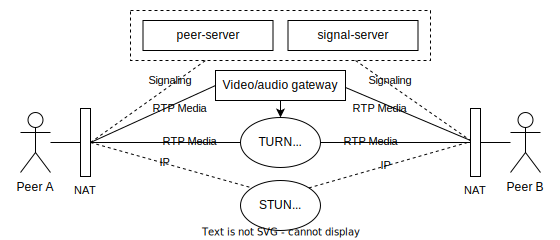

# WebRTC Hangout App

[[Docker image](https://hub.docker.com/r/milosz08/webrtc-hangout-app)] |
[[About project](https://miloszgilga.pl/project/webrtc-hangout-app)] |
[[Trello board](https://trello.com/b/vOwic0HM/siim-projekt)]

A simple video hangout app built with WebRTC for P2P connections. It uses a signaling server based on Express and
Socket.io to establish calls.

This application allows users to join video rooms with their microphone and camera enabled. Each room also features an
integrated text chat for participants without audio/video hardware or for those who prefer to type. By implementing the
ICE protocol with STUN and TURN servers, the app can effectively bypass NAT and firewall issues, ensuring reliable
connections between users (see diagram below).

Below you can find infrastructure diagram (with STUN/TURN servers and signaling servers):



## Table of content

* [Clone and run](#clone-and-run)
* [Prepare development environment](#prepare-development-environment)
* [Tech stack](#tech-stack)
* [Author](#author)
* [License](#license)

## Clone and run

1. Clone repository on your local machine via:

```bash
$ git clone https://github.com/milosz08/webrtc-hangout-app
```

2. Create `.env` file and fill up environment variables based on `example.env` file:

```properties
WHA_VITE_SERVER_PORT=6061
WHA_SIGNAL_SERVER_PORT=6062
WHA_PEER_SERVER_PORT=6063
WHA_APP_SERVER_PORT=6064
#
WHA_PEER_SERVER_HOST=localhost
WHA_PEER_SERVER_KEY=<peer server key>
WHA_STUN_SERVER_DOMAIN=<stun/turn server domain, ex. stun.miloszgilga.pl>
WHA_STUN_SERVER_KEY=<stun/turn server key>
WHA_ICE_EXPIRATION_MINUTES=<session expiration minutes>
WHA_LOGGING_TO_FILE=<true/false, set false for dockerized application>
```

> [!TIP]
> For quick application testing, you can use the managed ICE servers from a service like 
> [Metered](https://dashboard.metered.ca). For advanced use cases, consider deploying your own open-source
> [coturn](https://github.com/coturn/coturn) server on a cloud instance, such as AWS EC2 or Oracle OCI, ensuring it has
> a static public IP address.

3. Run combined app (frontend with signaling server) and Peer server via:

```bash
$ docker compose up -d
```

By default, applications will be listening at:

| Name        | Port | Link                                    |
|-------------|------|-----------------------------------------|
| peer-server | 6063 | [localhost:6063](http://localhost:6063) |
| app         | 6064 | [localhost:6064](http://localhost:6064) |

## Prepare development environment

1. Clone and create `.env` file.
2. Run Peer server via docker:

```bash
$ docker compose up -d video-hangout-peerjs
```

3. Install all dependencies via:

```bash
$ yarn install --frozen-lockfile
```

> [!TIP]
> If you don't have yarn yet, install via: `npm i -g yarn`.

4. Run client and signal-server via:

```bash
$ yarn run dev:client
$ yarn run dev:signal-server
```

By default, applications will be listening at:

| Name          | Port | Link                                    |
|---------------|------|-----------------------------------------|
| client        | 6061 | [localhost:6061](http://localhost:6061) |
| signal-server | 6062 | [localhost:6062](http://localhost:6062) |
| peer-server   | 6063 | [localhost:6063](http://localhost:6063) |

## Tech stack

* Node.js,
* Express,
* Socket.io,
* PeerJS,
* WebRTC,
* React 18, React router 6,
* Tailwind (flowbite), notistack.

## Author

Created by Miłosz Gilga. If you have any questions about this application, send
message: [miloszgilga@gmail.com](mailto:miloszgilga@gmail.com).

## License

This project is licensed under the Apache 2.0 License.
